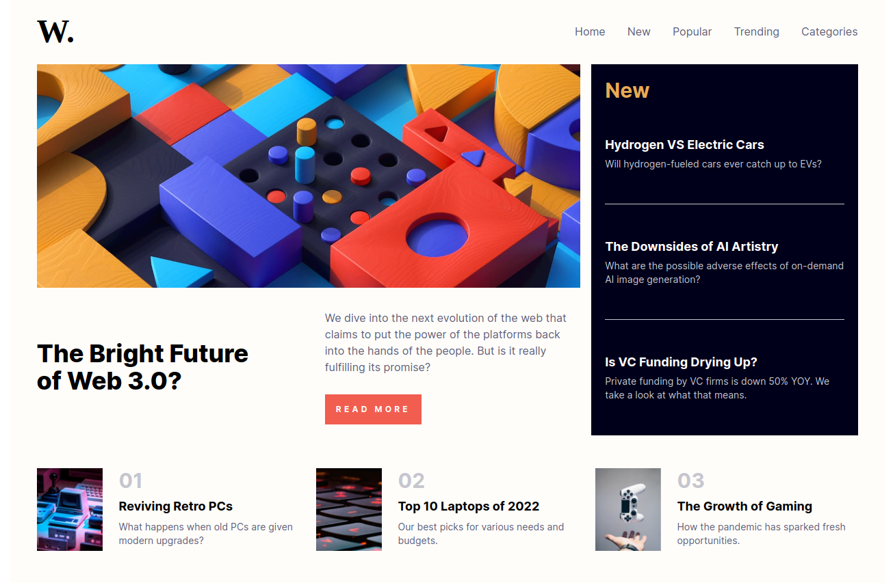

# Frontend Mentor - News homepage solution

This is a solution to the [News homepage challenge on Frontend Mentor](https://www.frontendmentor.io/challenges/news-homepage-H6SWTa1MFl). Frontend Mentor challenges help you improve your coding skills by building realistic projects. 

## Table of contents

- [Overview](#overview)
  - [The challenge](#the-challenge)
  - [Screenshot](#screenshot)
  - [Links](#links)
- [My process](#my-process)
  - [Built with](#built-with)
  - [What I learned](#what-i-learned)

## Overview

### The challenge

Users should be able to:

- View the optimal layout for the interface depending on their device's screen size
- See hover and focus states for all interactive elements on the page

### Screenshot

### Links

- Solution URL: [https://github.com/ryangholland/news-homepage]
- Live Site URL: [https://verdant-bavarois-d0a0cd.netlify.app/]

## My process

### Built with

- React
- Tailwind
- CSS Grid
- Mobile-first workflow

### What I learned

This was my very first project using Tailwind. Even though I had to constantly look through the documentation to figure out how to do certain things, the process still felt faster and more efficient than Vanilla CSS. I'm looking forward to using Tailwind again in the future and getting more comfortable with it.

